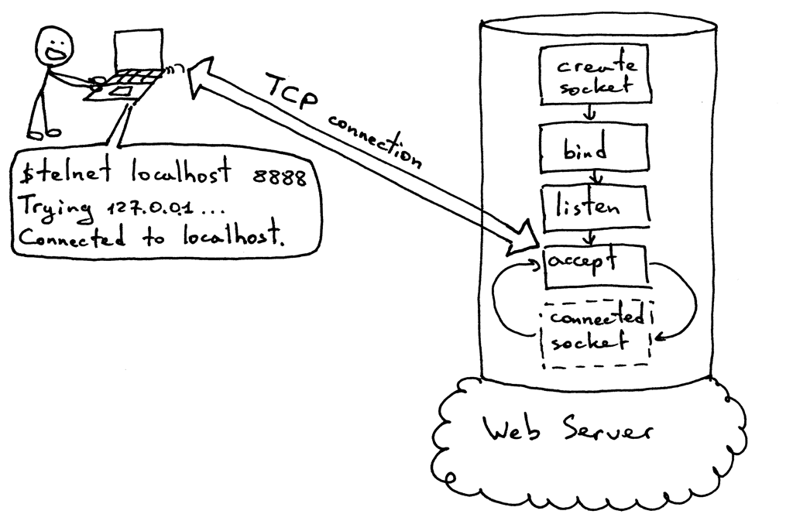
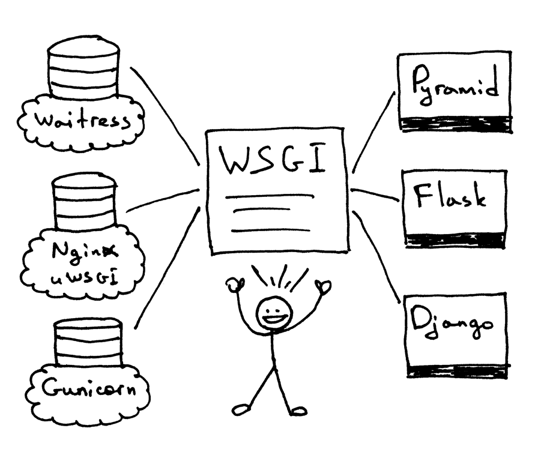

The whole idea of the webserver1.py is the following picture. 

____________________________________________________
In the part 2, we will look at how different framework such as FastAPI, Django, Flask can run on 
multiple type of server such as : Nginx, Apache, ... And the answer to that problem became the Python Web Server Gateway Interface (or WSGI for short, pronounced “wizgy”).

